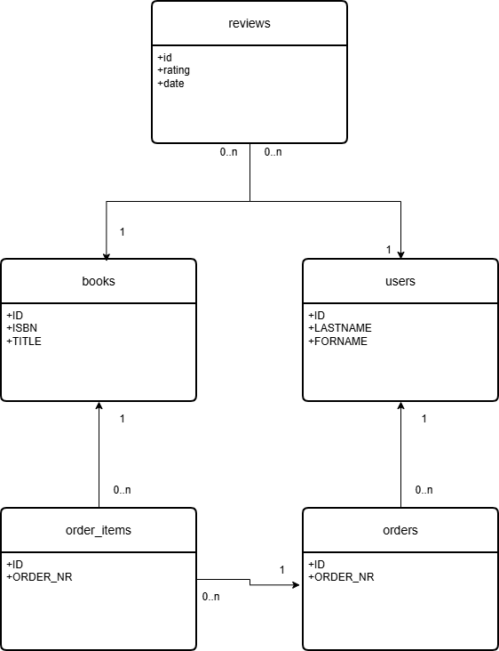

# LibroEgge

This application was generated using JHipster 9.0.0-beta.3, you can find documentation and help at [https://www.jhipster.tech/documentation-archive/v9.0.0-beta.3](https://www.jhipster.tech/documentation-archive/v9.0.0-beta.3).

This is a "microservice" application intended to be part of a microservice architecture, please refer to the [Doing microservices with JHipster][] page of the documentation for more information.

## Project Structure

Node is required for generation and recommended for development. `package.json` is always generated for a better development experience with prettier, commit hooks, scripts and so on.

In the project root, JHipster generates configuration files for tools like git, prettier, eslint, husky, and others that are well known and you can find references in the web.

`/src/*` structure follows default Java structure.

- `.yo-rc.json` - Yeoman configuration file
  JHipster configuration is stored in this file at `generator-jhipster` key. You may find `generator-jhipster-*` for specific blueprints configuration.
- `.yo-resolve` (optional) - Yeoman conflict resolver
  Allows to use a specific action when conflicts are found skipping prompts for files that matches a pattern. Each line should match `[pattern] [action]` with pattern been a [Minimatch](https://github.com/isaacs/minimatch#minimatch) pattern and action been one of skip (default if omitted) or force. Lines starting with `#` are considered comments and are ignored.
- `.jhipster/*.json` - JHipster entity configuration files

- `npmw` - wrapper to use locally installed npm.
  JHipster installs Node and npm locally using the build tool by default. This wrapper makes sure npm is installed locally and uses it avoiding some differences different versions can cause. By using `./npmw` instead of the traditional `npm` you can configure a Node-less environment to develop or test your application.
- `/src/main/docker` - Docker configurations for the application and services that the application depends on

## Database



### DDL Script for postgres DB

````postgresql
-- Books table
CREATE TABLE books (
                     id              BIGINT PRIMARY KEY GENERATED ALWAYS AS IDENTITY,
                     title           VARCHAR(255) NOT NULL,
                     author          VARCHAR(255) NOT NULL,
                     isbn            VARCHAR(20) UNIQUE,
                     publication_year INTEGER,
                     genre           VARCHAR(100),
                     description     TEXT,
                     created_at      TIMESTAMP DEFAULT CURRENT_TIMESTAMP NOT NULL,
                     updated_at      TIMESTAMP DEFAULT CURRENT_TIMESTAMP NOT NULL
);

-- Users table
CREATE TABLE users (
                     id              SERIAL PRIMARY KEY,
                     email           VARCHAR(255) NOT NULL UNIQUE,
                     password_hash   VARCHAR(255) NOT NULL,
                     firstname       VARCHAR(255) NOT NULL,
                     lastname        VARCHAR(255) NOT NULL,
                     role            VARCHAR(50) NOT NULL DEFAULT 'USER'
                       CHECK (role IN ('USER', 'ADMIN')),
                     is_active       BOOLEAN NOT NULL DEFAULT TRUE,
                     phone_number    VARCHAR(30),
                     address         TEXT,
                     created_at      TIMESTAMP WITH TIME ZONE NOT NULL DEFAULT CURRENT_TIMESTAMP,
                     updated_at      TIMESTAMP WITH TIME ZONE NOT NULL DEFAULT CURRENT_TIMESTAMP
);

-- Orders table (header – one per order)
CREATE TABLE orders (
                      id              SERIAL PRIMARY KEY,
                      order_nr        VARCHAR(50) UNIQUE NOT NULL,
                      user_id         INTEGER NOT NULL,
                      status          VARCHAR(30) NOT NULL DEFAULT 'PENDING'
                        CHECK (status IN ('PENDING', 'PAID', 'SHIPPED', 'DELIVERED', 'CANCELLED')),
                      total_amount    DECIMAL(10,2) NOT NULL DEFAULT 0.00,
                      shipping_address TEXT,
                      payment_method  VARCHAR(50),
                      created_at      TIMESTAMP WITH TIME ZONE NOT NULL DEFAULT CURRENT_TIMESTAMP,
                      updated_at      TIMESTAMP WITH TIME ZONE NOT NULL DEFAULT CURRENT_TIMESTAMP,

                      FOREIGN KEY (user_id) REFERENCES users(id) ON DELETE RESTRICT
);

-- Order items (many per order)
CREATE TABLE order_items (
                           id              SERIAL PRIMARY KEY,
                           order_id        INTEGER NOT NULL,
                           book_id         BIGINT NOT NULL,
                           quantity        INTEGER NOT NULL CHECK (quantity > 0),
                           unit_price      DECIMAL(10,2) NOT NULL,     -- price at time of order
                           subtotal        DECIMAL(10,2) NOT NULL,     -- quantity × unit_price

                           FOREIGN KEY (order_id) REFERENCES orders(id) ON DELETE CASCADE,
                           FOREIGN KEY (book_id)  REFERENCES books(id)  ON DELETE RESTRICT
);

-- Reviews table
CREATE TABLE reviews (
                       id              SERIAL PRIMARY KEY,
                       rating          INTEGER NOT NULL CHECK (rating >= 1 AND rating <= 5),
                       title           VARCHAR(150),
                       comment         TEXT,
                       date            TIMESTAMP WITH TIME ZONE DEFAULT CURRENT_TIMESTAMP,
                       book_id         BIGINT NOT NULL,
                       user_id         INTEGER NOT NULL,

                       FOREIGN KEY (book_id) REFERENCES books(id)   ON DELETE CASCADE,
                       FOREIGN KEY (user_id) REFERENCES users(id)   ON DELETE CASCADE
);

-- =============================================================================
-- Indexes – performance & foreign key lookups
-- =============================================================================

-- Books
CREATE INDEX idx_books_title  ON books (title);
CREATE INDEX idx_books_author ON books (author);
CREATE INDEX idx_books_isbn   ON books (isbn);

-- Users
CREATE INDEX idx_users_email  ON users (email);
CREATE INDEX idx_users_role   ON users (role);

-- Orders
CREATE INDEX idx_orders_user_id   ON orders (user_id);
CREATE INDEX idx_orders_status    ON orders (status);
CREATE INDEX idx_orders_order_nr  ON orders (order_nr);

-- Order items
CREATE INDEX idx_order_items_order_id ON order_items (order_id);
CREATE INDEX idx_order_items_book_id  ON order_items (book_id);

-- Reviews
CREATE INDEX idx_reviews_book_id ON reviews (book_id);
CREATE INDEX idx_reviews_user_id ON reviews (user_id);
CREATE INDEX idx_reviews_rating  ON reviews (rating);
CREATE INDEX idx_reviews_date    ON reviews (date);```

## Mock Data

### Table: BOOKS

```sql
INSERT INTO books (isbn, title, author, description, publication_year, genre, language, price, stock_quantity, created_at, updated_at) VALUES
('978-0142437230', 'Pride and Prejudice', 'Jane Austen', 'A classic romance novel exploring love, class, and societal expectations in 19th-century England.', 1813, 'Romance', 'English', 9.99, 45, CURRENT_TIMESTAMP, CURRENT_TIMESTAMP),
('978-0547928227', 'The Hobbit', 'J.R.R. Tolkien', 'Bilbo Baggins'' unexpected journey with dwarves and a dragon in Middle-earth.', 1937, 'Fantasy', 'English', 12.50, 28, CURRENT_TIMESTAMP, CURRENT_TIMESTAMP),
('978-0061120084', 'To Kill a Mockingbird', 'Harper Lee', 'A powerful story about racial injustice and moral growth in the American South.', 1960, 'Fiction', 'English', 8.75, 62, CURRENT_TIMESTAMP, CURRENT_TIMESTAMP),
('978-0307474278', '1984', 'George Orwell', 'Dystopian novel about totalitarianism, surveillance, and truth manipulation.', 1949, 'Dystopian', 'English', 11.20, 19, CURRENT_TIMESTAMP, CURRENT_TIMESTAMP),
('978-0743273565', 'The Great Gatsby', 'F. Scott Fitzgerald', 'A tragic tale of love, wealth, and the American Dream in the Jazz Age.', 1925, 'Classic', 'English', 7.99, 53, CURRENT_TIMESTAMP, CURRENT_TIMESTAMP),
('978-3453318519', 'Der Vorleser', 'Bernhard Schlink', 'A haunting German novel about love, guilt, and the legacy of the Holocaust.', 1995, 'Drama', 'German', 10.80, 14, CURRENT_TIMESTAMP, CURRENT_TIMESTAMP),
('978-3551551672', 'Harry Potter und der Stein der Weisen', 'J.K. Rowling', 'The first book in the magical Harry Potter series.', 1997, 'Fantasy', 'German', 14.99, 37, CURRENT_TIMESTAMP, CURRENT_TIMESTAMP),
('978-3104027258', 'Homo Deus', 'Yuval Noah Harari', 'A provocative exploration of humanity''s future in the age of data and algorithms.', 2015, 'Non-Fiction', 'German', 24.00, 8, CURRENT_TIMESTAMP, CURRENT_TIMESTAMP),
('978-2266264327', 'L''Étranger', 'Albert Camus', 'Existential novel about absurdity, indifference, and the human condition.', 1942, 'Philosophy', 'French', 8.50, 22, CURRENT_TIMESTAMP, CURRENT_TIMESTAMP),
('978-8804668787', 'Il nome della rosa', 'Umberto Eco', 'A medieval murder mystery filled with semiotics, theology, and libraries.', 1980, 'Historical Mystery', 'Italian', 16.90, 11, CURRENT_TIMESTAMP, CURRENT_TIMESTAMP);
````

### Table: USERS

```sql
INSERT INTO users (
    email,
    password_hash,
    forname,
    lastname,
    role,
    phone_number,
    address,
    is_active
) VALUES
    ('anna.muster@example.com',   '$2b$12$fakehash1234567890', 'Anna',   'Muster',   'USER',  '+49 151 12345678', 'Musterstraße 12, 80331 München', TRUE),
    ('max.beispiel@email.de',      '$2b$12$fakehash0987654321', 'Max',    'Beispiel', 'USER',  '+49 176 98765432', 'Beispielweg 5, 10115 Berlin',     TRUE),
    ('sophie.leserin@web.de',      '$2b$12$fakehashabcdef1234', 'Sophie', 'Leserin',  'USER',  NULL,               'Leserallee 3, 50667 Köln',        TRUE),
    ('admin@libroegge.de',         '$2b$12$adminhashstrong2026', 'Admin',  'Admin',    'ADMIN', '+49 30 5555555',   'Verwaltung 1, 20095 Hamburg',     TRUE),
    ('inactive.user@test.com',     '$2b$12$fakehashzzzzzzzzzz', 'Inactive','User',     'USER',  NULL,               NULL,                              FALSE);
```

### Table: Reviews

```sql
    INSERT INTO reviews (
      book_id, user_id, rating, title, comment,created_at, updated_at, is_helpful_count
    ) VALUES
      (1, 1, 5, 'A timeless favorite', 'Jane Austen’s wit is unmatched. Elizabeth Bennet is such an icon.',
      CURRENT_TIMESTAMP - 18, CURRENT_TIMESTAMP - 18, 14),
      (1, 3, 4, 'Charming but dated', 'Loved the romance, but some social commentary feels old-fashioned now.',
      CURRENT_TIMESTAMP - 12, CURRENT_TIMESTAMP - 12, 5),
      (2, 2, 5, 'Perfect adventure', 'Bilbo’s journey is pure magic. Read it as a child and still love it.',
      CURRENT_TIMESTAMP - 25, CURRENT_TIMESTAMP - 25, 11),
      (2, 4, 5, 'Epic fantasy start', 'Tolkien at his most accessible. Great introduction to Middle-earth.',
      CURRENT_TIMESTAMP - 9, CURRENT_TIMESTAMP - 9, 8),
      (3, 1, 5, 'Profound and necessary', 'Harper Lee captures empathy and injustice so powerfully.',
      CURRENT_TIMESTAMP - 7, CURRENT_TIMESTAMP - 7, 19),
      (3, 5, 5, 'Still relevant today', 'Atticus Finch is a role model. Everyone should read this.',
      CURRENT_TIMESTAMP - 4, CURRENT_TIMESTAMP - 4, 13),
      (4, 3, 4, 'Unsettling masterpiece', 'Big Brother is watching – and it feels more real every year.',
      CURRENT_TIMESTAMP - 15, CURRENT_TIMESTAMP - 15, 10),
      (4, 2, 5, 'Chilling warning', 'Orwell predicted so much. A must-read for understanding power.',
      CURRENT_TIMESTAMP - 6, CURRENT_TIMESTAMP - 6, 7),
      (5, 4, 3, 'Beautiful writing, empty story', 'Gorgeous prose, but the characters left me cold.',
      CURRENT_TIMESTAMP - 10, CURRENT_TIMESTAMP - 10, 4),
      (5, 1, 4, 'The American Dream dissected', 'Fitzgerald nails the illusion of wealth and happiness.',
      CURRENT_TIMESTAMP - 2, CURRENT_TIMESTAMP - 2, 6);
```

### Table: Orders

```sql
      INSERT INTO orders (
        user_id, order_nr, status, total_amount, created_at, updated_at, shipping_address, payment_method
      ) VALUES
        (1, 'ORD-20260219-001', 'DELIVERED',  28.48, CURRENT_TIMESTAMP - 20, CURRENT_TIMESTAMP - 20, 'Musterstraße 12, 80331 München', 'CREDIT_CARD'),
        (2, 'ORD-20260219-002', 'SHIPPED',    12.50, CURRENT_TIMESTAMP - 15, CURRENT_TIMESTAMP - 15, 'Beispielweg 5, 10115 Berlin',      'PAYPAL'),
        (3, 'ORD-20260219-003', 'PENDING',    19.74, CURRENT_TIMESTAMP - 10, CURRENT_TIMESTAMP - 10, 'Leserallee 3, 50667 Köln',         'CREDIT_CARD'),
        (4, 'ORD-20260219-004', 'DELIVERED',  35.99, CURRENT_TIMESTAMP - 5,  CURRENT_TIMESTAMP - 5,  'Verwaltung 1, 20095 Hamburg',     'CREDIT_CARD'),
        (1, 'ORD-20260219-005', 'CANCELLED',   9.99, CURRENT_TIMESTAMP - 2,  CURRENT_TIMESTAMP - 2,  'Musterstraße 12, 80331 München', 'PAYPAL');
        -- Fake order_items (multiple items per order)
      INSERT INTO order_items (
        order_id, book_id, quantity, unit_price, subtotal
      ) VALUES
      -- Order 1 (user 1): two books
        (1, 1, 1,  9.99,  9.99),
        (1, 3, 2,  8.75, 17.50),   -- subtotal 27.49 + shipping/tax ~28.48
      -- Order 2 (user 2): one book
        (2, 2, 1, 12.50, 12.50),
      -- Order 3 (user 3): one book
        (3, 5, 2,  7.99, 15.98),
      -- Order 4 (user 4): three books
        (4, 4, 1, 11.20, 11.20),
        (4, 1, 1,  9.99,  9.99),
        (4, 2, 1, 12.50, 12.50),   -- total ~33.69 + tax/shipping ~35.99
      -- Order 5 (user 1): cancelled single item
        (5, 1, 1,  9.99,  9.99);

```

## Development

The build system will install automatically the recommended version of Node and npm.

We provide a wrapper to launch npm.
You will only need to run this command when dependencies change in [package.json](package.json).

```bash
./npmw install
```

We use npm scripts and [Angular CLI](https://angular.dev/tools/cli) with Webpack as our build system.

If you are using hazelcast as a cache, you will have to launch a cache server.
To start your cache server, run:

```bash
docker compose -f src/main/docker/hazelcast-management-center.yml up -d
```

Run the following commands in two separate terminals to create a blissful development experience where your browser
auto-refreshes when files change on your hard drive.

```bash
./npmw run backend:start
./npmw run start
```

Npm is also used to manage CSS and JavaScript dependencies used in this application. You can upgrade dependencies by
specifying a newer version in [package.json](package.json). You can also run `./npmw update` and `./npmw install` to manage dependencies.
Add the `help` flag on any command to see how you can use it. For example, `./npmw help update`.

The `./npmw run` command will list all the scripts available to run for this project.

### PWA Support

JHipster ships with PWA (Progressive Web App) support, and it's turned off by default. One of the main components of a PWA is a service worker.

The service worker initialization code is disabled by default. To enable it, uncomment the following code in `src/main/webapp/app/app.config.ts`:

```typescript
ServiceWorkerModule.register('ngsw-worker.js', { enabled: false }),
```

### Managing dependencies

For example, to add [Leaflet](https://leafletjs.com/) library as a runtime dependency of your application, you would run the following command:

```bash
./npmw install --save --save-exact leaflet
```

To benefit from TypeScript type definitions from [DefinitelyTyped](https://definitelytyped.org/) repository in development, you would run the following command:

```bash
./npmw install --save-dev --save-exact @types/leaflet
```

Then you would import the JS and CSS files specified in library's installation instructions so that [Webpack][] knows about them:
Edit [src/main/webapp/app/app.config.ts](src/main/webapp/app/app.config.ts) file:

```typescript
import 'leaflet/dist/leaflet.js';
```

Edit [src/main/webapp/content/scss/vendor.scss](src/main/webapp/content/scss/vendor.scss) file:

```typescript
@import 'leaflet/dist/leaflet.css';
```

Note: There are still a few other things remaining to do for Leaflet that we won't detail here.

For further instructions on how to develop with JHipster, have a look at [Using JHipster in development](https://www.jhipster.tech/development/).

### Developing Microfrontend

Microservices doesn't contain every required backend feature to allow microfrontends to run alone.
You must start a pre-built gateway version or from source.

Start gateway from source:

```bash
cd gateway
./npmw run docker:db:up # start database if necessary
./npmw run docker:others:up # start service discovery and authentication service if necessary
./npmw run app:start # alias for ./(mvnw|gradlew)
```

Microfrontend's `build-watch` script is configured to watch and compile microfrontend's sources and synchronizes with gateway's frontend.
Start it using:

```bash
cd microfrontend
./npmw run docker:db:up # start database if necessary
./npmw run build-watch
```

It's possible to run microfrontend's frontend standalone using:

```bash
cd microfrontend
./npmw run docker:db:up # start database if necessary
./npmw watch # alias for `npm start` and `npm run backend:start` in parallel
```

### Using Angular CLI

You can also use [Angular CLI](https://angular.dev/tools/cli) to generate some custom client code.

For example, the following command:

```bash
ng generate component my-component
```

will generate few files:

```bash
create src/main/webapp/app/my-component/my-component.html
create src/main/webapp/app/my-component/my-component.ts
update src/main/webapp/app/app.config.ts
```

## Building for production

### Packaging as jar

To build the final jar and optimize the LibroEgge application for production, run:

```bash
./mvnw -Pprod clean verify
```

This will concatenate and minify the client CSS and JavaScript files. It will also modify `index.html` so it references these new files.
To ensure everything worked, run:

```bash
java -jar target/*.jar
```

Then navigate to [http://localhost:8081](http://localhost:8081) in your browser.

Refer to [Using JHipster in production][] for more details.

### Packaging as war

To package your application as a war in order to deploy it to an application server, run:

```bash
./mvnw -Pprod,war clean verify
```

### JHipster Control Center

JHipster Control Center can help you manage and control your application(s). You can start a local control center server (accessible on http://localhost:7419) with:

```bash
docker compose -f src/main/docker/jhipster-control-center.yml up
```

## Testing

### Spring Boot tests

To launch your application's tests, run:

```bash
./mvnw verify
```

### Client tests

Unit tests are run by Vitest. They're located near components and can be run with:

```bash
./npmw test
```

## Others

### Code quality using Sonar

Sonar is used to analyse code quality. You can start a local Sonar server (accessible on http://localhost:9001) with:

```bash
docker compose -f src/main/docker/sonar.yml up -d
```

Note: we have turned off forced authentication redirect for UI in [src/main/docker/sonar.yml](src/main/docker/sonar.yml) for out of the box experience while trying out SonarQube, for real use cases turn it back on.

You can run a Sonar analysis with using the [sonar-scanner](https://docs.sonarqube.org/display/SCAN/Analyzing+with+SonarQube+Scanner) or by using the maven plugin.

Then, run a Sonar analysis:

```bash
./mvnw -Pprod clean verify sonar:sonar -Dsonar.login=admin -Dsonar.password=admin
```

If you need to re-run the Sonar phase, please be sure to specify at least the `initialize` phase since Sonar properties are loaded from the sonar-project.properties file.

```bash
./mvnw initialize sonar:sonar -Dsonar.login=admin -Dsonar.password=admin
```

Additionally, Instead of passing `sonar.password` and `sonar.login` as CLI arguments, these parameters can be configured from [sonar-project.properties](sonar-project.properties) as shown below:

```bash
sonar.login=admin
sonar.password=admin
```

For more information, refer to the [Code quality page][].

### Docker Compose support

JHipster generates a number of Docker Compose configuration files in the [src/main/docker/](src/main/docker/) folder to launch required third party services.

For example, to start required services in Docker containers, run:

```bash
docker compose -f src/main/docker/services.yml up -d
```

To stop and remove the containers, run:

```bash
docker compose -f src/main/docker/services.yml down
```

[Spring Docker Compose Integration](https://docs.spring.io/spring-boot/reference/features/dev-services.html) is enabled by default. It's possible to disable it in `application.yml`:

```yaml
spring:
  ...
  docker:
    compose:
      enabled: false
```

You can also fully dockerize your application and all the services that it depends on.
To achieve this, first build a Docker image of your app by running:

```bash
npm run java:docker
```

Or build an arm64 Docker image when using an arm64 processor OS, i.e., Apple Silicon chips (M\*), running:

```bash
npm run java:docker:arm64
```

Then run:

```bash
docker compose -f src/main/docker/app.yml up -d
```

For more information refer to [Docker and Docker-Compose](https://www.jhipster.tech/documentation-archive/v9.0.0-beta.3/docker-compose/), this page also contains information on the Docker Compose sub-generator (`jhipster docker-compose`), which is able to generate Docker configurations for one or several JHipster applications.

## Continuous Integration (optional)

To configure CI for your project, run the ci-cd sub-generator (`jhipster ci-cd`), this will let you generate configuration files for a number of Continuous Integration systems. Consult the [Setting up Continuous Integration](https://www.jhipster.tech/documentation-archive/v9.0.0-beta.3/setting-up-ci/) page for more information.

## References

- [JHipster Homepage and latest documentation](https://www.jhipster.tech/)
- [JHipster 9.0.0-beta.3 archive](https://www.jhipster.tech/documentation-archive/v9.0.0-beta.3)
- [Doing microservices with JHipster](https://www.jhipster.tech/documentation-archive/v9.0.0-beta.3/microservices-architecture/)
- [Using JHipster in development](https://www.jhipster.tech/documentation-archive/v9.0.0-beta.3/development/)
- [Using Docker and Docker-Compose](https://www.jhipster.tech/documentation-archive/v9.0.0-beta.3/docker-compose)
- [Using JHipster in production](https://www.jhipster.tech/documentation-archive/v9.0.0-beta.3/production/)
- [Running tests page](https://www.jhipster.tech/documentation-archive/v9.0.0-beta.3/running-tests/)
- [Code quality page](https://www.jhipster.tech/documentation-archive/v9.0.0-beta.3/code-quality/)
- [Setting up Continuous Integration](https://www.jhipster.tech/documentation-archive/v9.0.0-beta.3/setting-up-ci/)
- [Node.js](https://nodejs.org/)
- [NPM](https://www.npmjs.com/)
- [Webpack](https://webpack.js.org/)
- [BrowserSync](https://www.browsersync.io/)
- [Jest](https://jestjs.io)
- [Leaflet](https://leafletjs.com/)
- [DefinitelyTyped](https://definitelytyped.org/)
- [Angular CLI](https://angular.dev/tools/cli)
